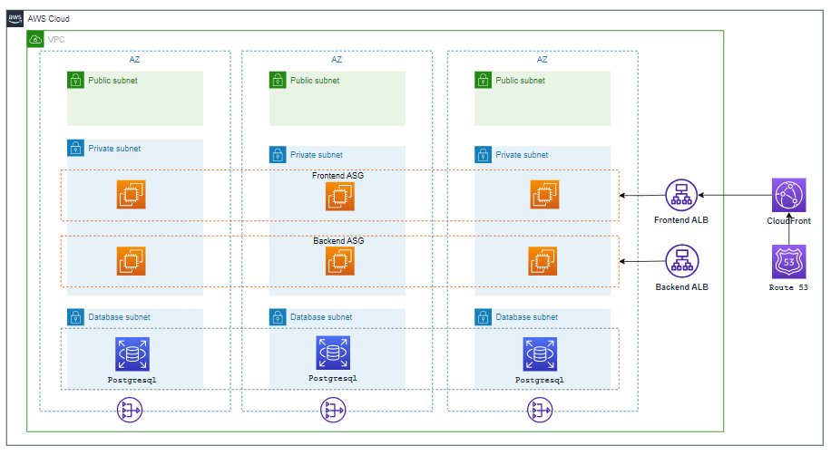

# 3-Tier Infrastructure on AWS

## Description

Three-Tier Application Architecture IaC blueprint is a valuable tool for a cross-functional team involved in the development, deployment, and maintenance of a three-tier application on a cloud platform.
Resources used here are the network layer, launch template, auto-scaling group, load balancer, RDS, WAF, CloudFront, and route53.The end user should be able to deploy a refined 3-tier web application architecture into AWS with the help of Jenkins pipeline using CFT / IaC.
- Who can use Three-Tier Application Architecture:
    - Cloud architects can utilize the IaC blueprint to define and provision the infrastructure components required for the three-tier application on a cloud platform. This includes setting up virtual machines, networking, and other cloud services
    - Infrastructure engineers are responsible for designing and maintaining the underlying infrastructure.
    - DevOps engineers play a key role in automating the deployment pipeline. They can integrate the IaC blueprint into continuous integration/continuous deployment (CI/CD) workflows, ensuring consistent and repeatable infrastructure deployments.
    - System administrators are involved in managing and maintaining the servers and services in each tier. They can benefit from the IaC blueprint by having a standardized and automated way to deploy and configure infrastructure components.
    - Developers can leverage the IaC blueprint to define infrastructure requirements alongside application code. This allows for a more collaborative approach between development and operations, often referred to as DevOps
    - Cloud administrators, who focus on managing cloud resources and services, can utilize the IaC blueprint to automate the provisioning and configuration of cloud-specific components in the three-tier application.
    
## Overview
- This is a Jinja templates for creating the resources like AWS using Amazon Virtual Private Cloud (Amazon VPC), Amazon Elastic Compute Cloud (Amazon EC2), Auto Scaling, Elastic Load Balancing (Application Load Balancer), Amazon Relational Database Service (Amazon RDS), Amazon CloudFront, Amazon Route 53, Amazon Certificate Manager (Amazon ACM) with AWS CloudFormation.
- This AWS CloudFormation template is designed to create a 3-tier stack. The stack consists of multiple components, including Amazon Virtual Private Cloud (Amazon VPC), Amazon Elastic Compute Cloud (Amazon EC2), Auto Scaling, Elastic Load Balancing (Application Load Balancer), Amazon Relational Database Service (Amazon RDS), Amazon ElastiCache, Amazon Elastic File System (Amazon EFS), Amazon CloudFront, Amazon Route 53 and Amazon Certificate Manager (Amazon ACM). This template is designed to be customizable with various parameters to adapt to different environments and use cases.

## Parameters
The template includes several parameters that allow you to customize the deployment:
1. **Env**: The name of the environment (e.g., "dev," "prod").
2. **StackName**: The name of the CloudFormation stack to create.
- Network Configuration
3. **VPCCIDR**: The CIDR range for your Virtual Private Cloud (VPC).
4. **PublicSubnetCIDRs**: A list of public subnet CIDR blocks inside the VPC.
5. **AppSubnetCIDRs**: A list of private subnet CIDR blocks inside the VPC.
6. **DataSubnetCIDRs**: A list of database subnet CIDR blocks inside the VPC.
- Launch Template & ASG Configuration
7. **KeyPair**: The name of the Key Pair to use for EC2 instances.
8. **InstanceType**: The type of EC2 instances to launch.
9. **AmiId**: The ID of the Amazon Machine Image (AMI) to use for EC2 instances.
10. **LinuxDeviceName**: AWS EBS device names for Linux instances.
11. **WindowsDeviceName**: AWS EBS device names for Windows instances.
12. **VolumeSizes**: Volume sizes to be attached to the launch template.
13. **VolumeType**: Volume types to be attached to the launch template.
14. **OperatingSystem**: The type of operating system for EC2 instances (Linux or Windows).
15. **Ingressrules**: A list of inbound rules for security groups.
- ASG Configuration
16. **MinimumSize**: The minimum number of instances in the Auto Scaling group.
17. **MaximumSize**: The maximum number of instances in the Auto Scaling group.
18. **DesiredCapacity**: The desired capacity of the Auto Scaling group.
- Load Balancer Configuration
19. **ACMCertificateAlb**: A list of SSL/TLS certificates for the Application Load Balancer (ALB).
20. **LoadBalancingAction**: Choose a load balancer action (e.g., Attach_ALB_NLB).
- Amazon RDS Cluster Configuration
21. **RdsClusterIdentifier**: The name of the Amazon RDS DB cluster.
22. **EngineType**: Choose the database engine type.
23. **EngineVersion**: Choose the database engine version.
24. **DbMasterUsername**: DB master username.
25. **DbMasterPassword**: DB master password (not echoed).
26. **DbInstanceClass**: DB instance class.
- Amazon CloudFront Configuration
27. **DomainName**: The domain name for CloudFront distribution.
28. **ACMCertificateCloudFront**: A list of SSL/TLS certificates for CloudFront.
29. **HostedZoneid**: Choose a hosted zone ID for Route 53.

## Conditions
- These are conditionals that can be used to control resource creation within the CloudFormation template. They are based on the values of certain parameters or resource attributes. For example, there are conditions like IsWindows, UseClassicLoadBalancer etc., that determine whether specific resources should be created based on user-provided values.
- Below is the Condition variables defined in the template:
    - IsWindows: This condition checks whether the value of the OperatingSystem parameter (presumably defined elsewhere in your CloudFormation template) is equal to "windows." It's commonly used to conditionally set properties or resources that are specific to Windows-based instances or resources.
    - UseClassicLoadBalancer: This condition checks whether the value of the LoadBalancingAction parameter is equal to "Attach_Classic_Load_Balancer.". It can be used to conditionally determine whether to attach resources to a classic Elastic Load Balancer (ELB) or another type of load balancer.
    - ShouldAllocateDbClusterInstanceClass :This condition will checks if the EngineType parameter is neither "aurora-mysql" nor "aurora-postgresql". If either of these conditions is true, the ShouldAllocateDbClusterInstanceClass condition evaluates to true

## Resources
- VPC Creation
    - Creates a Virtual Private Cloud (VPC) with specified CIDR blocks and necessary configurations.
- Internet Gateway
    - Creates an Internet Gateway and attaches it to the VPC for public internet access.
- Public Subnets
    - Creates public subnets and associates them with a public route table.
- Private Subnets
    - Creates private subnets and associates them with a private route table.
- Database Subnets
    - Creates database subnets and associates them with a database route table.
- Security Groups
    - Defines security groups for various resources, including public, private, RDS, and Elasticache.
- Amazon RDS Cluster
    - Creates an Amazon RDS DB cluster with specified engine and configuration settings.
- CloudFront Distribution
    - Sets up an Amazon CloudFront distribution for content delivery.
- Route53 Record
    - Creates a Route53 DNS record to map the CloudFront distribution to a domain name.
- Launch template and Auto Scaling Groups
    - Defines Launch template and Auto Scaling groups for public and private instances.
- Target Group and Load Balancer:
    - Creates target group and load balancer to distribute the traffic among instances
- IAM Roles and Instance Profiles:
    - Creates IAM roles and instance profile for the instances    
## Jinja2 Templating
- Throughout the template, you can see Jinja2 syntax enclosed in double curly braces ({{ ... }}). These sections are placeholders for variables, and they likely get replaced with actual values when generating the CloudFormation template based on the context in which the Jinja template is processed.
## Rendering CFT Template
- It's important to note that the actual values for the parameters and Jinja2 variables must be provided when creating a CloudFormation stack using this template. These values will determine the specific configuration of the stack.
- To use this template to create an AWS CloudFormation stack, you would typically process it through a Jinja2 renderer tool to replace the Jinja2 variables with their actual values, and then submit the resulting CloudFormation template to AWS for stack creation. The template is quite extensive and set up a resources , including VPC, subnets, security groups, RDS clusters, Elasticache clusters, a CloudFront distribution, and more. The specific details of the infrastructure and its configuration would depend on the actual values provided for the parameters and Jinja2 variables.
- To render/parse the cloudofrmation jinja template to yaml use the below command
```
python3 render-templates.py <input_template_name>.j2 <variables_file_name>.yaml <output_cft_file_name>.yaml
```
## Usage
- From the above command the CFT template file(<output_cft_file_name>.yaml) will be generated, which can be used to create the stack AWS CFT.


