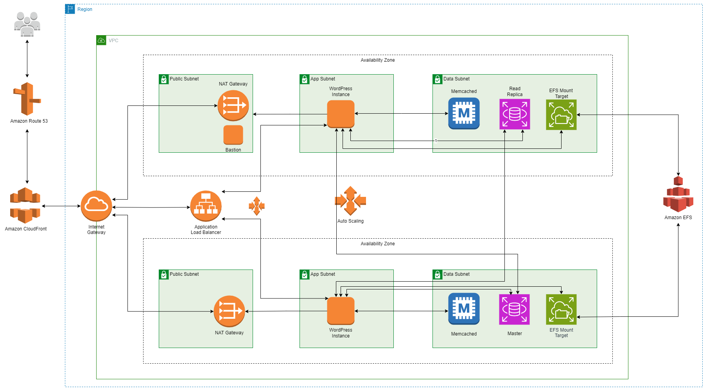

# 3-Tier WordPress Infrastructure on AWS


## Description

The Three-Tier Architecture for hosting WordPress on AWS, implemented through a IaC blueprint, can be utilized by various stakeholders involved in the development, deployment, and management of a WordPress website.  It provides a standardized and consistent approach to managing your infrastructure deployments across different environments, making it easier to maintain and evolve your applications over time.
We have utilized resources such as the network layer, launch template, auto-scaling group, load balancer, Elastic file system RDS,  CloudFront, and route53 for 3- tier Architecture to Host WP in AWS
- Who can use Three-Tier Architecture for Hosting WordPress on AWS
    - Content creators and editors are the end users who interact with the WordPress interface to create and publish content. The Three-Tier Architecture ensures a reliable and scalable environment for managing website content.
    - Cloud administrators can manage and monitor the AWS resources, ensuring that the EC2 instances, RDS databases, and other services are optimized for performance, cost, and compliance.
    - Infrastructure engineers are responsible for setting up and maintaining the AWS resources needed for hosting WordPress. They can use Terraform to define the infrastructure as code, making it scalable and easy to manage.
    - DevOps engineers play a crucial role in implementing and managing the infrastructure. They can use Terraform to define and deploy AWS resources, set up continuous integration/continuous deployment (CI/CD) pipelines, and manage configurations.
    - Developers can leverage the Three-Tier Architecture to host and scale WordPress applications on AWS. They can work on customizing the WordPress site, developing plugins, and managing the codebase.
    
## Overview
- This is a Jinja templates for deploying WordPress on AWS using Amazon Virtual Private Cloud (Amazon VPC), Amazon Elastic Compute Cloud (Amazon EC2), Auto Scaling, Elastic Load Balancing (Application Load Balancer), Amazon Relational Database Service (Amazon RDS), Amazon ElastiCache, Amazon Elastic File System (Amazon EFS), Amazon CloudFront, Amazon Route 53, Amazon Certificate Manager (Amazon ACM) with AWS CloudFormation.
- This AWS CloudFormation template is designed to create a 3-tier infrastructure stack for hosting a WordPress application. The stack consists of multiple components, including Amazon Virtual Private Cloud (Amazon VPC), Amazon Elastic Compute Cloud (Amazon EC2), Auto Scaling, Elastic Load Balancing (Application Load Balancer), Amazon Relational Database Service (Amazon RDS), Amazon ElastiCache, Amazon Elastic File System (Amazon EFS), Amazon CloudFront, Amazon Route 53 and Amazon Certificate Manager (Amazon ACM). This template is designed to be customizable with various parameters to adapt to different environments and use cases.

## Parameters
The template includes several parameters that allow you to customize the deployment:
1. **Env**: The name of the environment (e.g., "dev," "prod").
2. **StackName**: The name of the CloudFormation stack to create.
- Network Configuration
3. **VPCCIDR**: The CIDR range for your Virtual Private Cloud (VPC).
4. **PublicSubnetCIDRs**: A list of public subnet CIDR blocks inside the VPC.
5. **AppSubnetCIDRs**: A list of private subnet CIDR blocks inside the VPC.
6. **DataSubnetCIDRs**: A list of database subnet CIDR blocks inside the VPC.
- Launch Template & ASG Configuration
7. **KeyPair**: The name of the Key Pair to use for EC2 instances.
8. **InstanceType**: The type of EC2 instances to launch.
9. **AmiId**: The ID of the Amazon Machine Image (AMI) to use for EC2 instances.
10. **LinuxDeviceName**: AWS EBS device names for Linux instances.
11. **WindowsDeviceName**: AWS EBS device names for Windows instances.
12. **VolumeSizes**: Volume sizes to be attached to the launch template.
13. **VolumeType**: Volume types to be attached to the launch template.
14. **OperatingSystem**: The type of operating system for EC2 instances (Linux or Windows).
15. **Ingressrules**: A list of inbound rules for security groups.
- ASG Configuration
16. **MinimumSize**: The minimum number of instances in the Auto Scaling group.
17. **MaximumSize**: The maximum number of instances in the Auto Scaling group.
18. **DesiredCapacity**: The desired capacity of the Auto Scaling group.
- Load Balancer Configuration
19. **ACMCertificateAlb**: A list of SSL/TLS certificates for the Application Load Balancer (ALB).
20. **LoadBalancingAction**: Choose a load balancer action (e.g., Attach_ALB_NLB).
- Amazon EFS Configuration
21. **EncrpytedBoolean**: Create an encrypted Amazon EFS file system (true or false).
22. **PerformanceMode**: Select the performance mode of the file system (generalPurpose or maxIO).
23. **KMSId**: Provide the KMS key ID for encryption (if encrypted).
24. **ProvisionedThroughputInMibps**: The throughput for a provisioned file system (required if ThroughputMode is provisioned).
25. **ThroughputMode**: Specifies the throughput mode for the file system (bursting, provisioned, or elastic).
- Amazon RDS Cluster Configuration
26. **RdsClusterIdentifier**: The name of the Amazon RDS DB cluster.
27. **EngineType**: Choose the database engine type.
28. **EngineVersion**: Choose the database engine version.
29. **DbMasterUsername**: DB master username.
30. **DbMasterPassword**: DB master password (not echoed).
31. **DbInstanceClass**: DB instance class.
32. **EnableCloudwatchLogsExports**: Enable log exports to CloudWatch (Yes or No).
- Amazon CloudFront Configuration
33. **DomainName**: The domain name for CloudFront distribution.
34. **ACMCertificateCloudFront**: A list of SSL/TLS certificates for CloudFront.
35. **HostedZoneid**: Choose a hosted zone ID for Route 53.
- Amazon ElastiCache Configuration
36. **ElastiCacheNodeType**: Node type of the ElastiCache cluster.
37. **NumberOfSubnets**: Number of subnets for ElastiCache.

## Conditions
- These are conditionals that can be used to control resource creation within the CloudFormation template. They are based on the values of certain parameters or resource attributes. For example, there are conditions like IsWindows, UseClassicLoadBalancer, IsBursting, etc., that determine whether specific resources should be created based on user-provided values.
- Below is the Condition variables defined in the template:
    - IsWindows: This condition checks whether the value of the OperatingSystem parameter (presumably defined elsewhere in your CloudFormation template) is equal to "windows." It's commonly used to conditionally set properties or resources that are specific to Windows-based instances or resources.
    - UseClassicLoadBalancer: This condition checks whether the value of the LoadBalancingAction parameter is equal to "Attach_Classic_Load_Balancer.". It can be used to conditionally determine whether to attach resources to a classic Elastic Load Balancer (ELB) or another type of load balancer.
    - IsBursting: This condition checks whether the value of the ThroughputMode parameter is equal to "bursting." It can be used to determine whether an Amazon EFS (Elastic File System) file system should operate in bursting throughput mode, which provides burst credits for higher throughput.
    - ShouldUseCloudWatchLogs: This condition checks whether the value of the EnableCloudwatchLogsExports parameter is not equal to "No." It's typically used to conditionally enable or disable CloudWatch Logs exports for a resource. If CloudWatch Logs exports are not desired, the condition evaluates to false.
    - IsAuroraMySQL: This condition checks whether the value of the EngineType parameter is equal to "aurora-mysql." It's used to determine whether the database engine type is Aurora MySQL. You can use this condition to configure resources or properties specific to Aurora MySQL databases.
    - IsAuroraPostgreSQL: This condition checks whether the value of the EngineType parameter is equal to "aurora-postgresql." it's used to determine whether the database engine type is Aurora PostgreSQL. You can use this condition to configure resources or properties specific to Aurora PostgreSQL databases.

## Resources
- VPC Creation
    - Creates a Virtual Private Cloud (VPC) with specified CIDR blocks and necessary configurations.
- Internet Gateway
    - Creates an Internet Gateway and attaches it to the VPC for public internet access.
- Public Subnets
    - Creates public subnets and associates them with a public route table.
- Private Subnets
    - Creates private subnets and associates them with a private route table.
- Database Subnets
    - Creates database subnets and associates them with a database route table.
- Security Groups
    - Defines security groups for various resources, including public, private, RDS, and Elasticache.
- Elastic File System (EFS)
    - Creates an Amazon Elastic File System with optional encryption and performance settings.
- Amazon RDS Cluster
    - Creates an Amazon RDS DB cluster with specified engine and configuration settings.
- Amazon ElastiCache Cluster
    - Creates an Amazon ElastiCache cluster for caching.
- CloudFront Distribution
    - Sets up an Amazon CloudFront distribution for content delivery.
- Route53 Record
    - Creates a Route53 DNS record to map the CloudFront distribution to a domain name.
- Launch template and Auto Scaling Groups
    - Defines Launch template and Auto Scaling groups for public and private instances.
- Target Group and Load Balancer:
    - Creates target group and load balancer to distribute the traffic among instances
- IAM Roles and Instance Profiles:
    - Creates IAM roles and instance profile for the instances    
## Jinja2 Templating
- Throughout the template, you can see Jinja2 syntax enclosed in double curly braces ({{ ... }}). These sections are placeholders for variables, and they likely get replaced with actual values when generating the CloudFormation template based on the context in which the Jinja template is processed.
## Rendering CFT Template
- It's important to note that the actual values for the parameters and Jinja2 variables must be provided when creating a CloudFormation stack using this template. These values will determine the specific configuration of the stack.
- To use this template to create an AWS CloudFormation stack, you would typically process it through a Jinja2 renderer tool to replace the Jinja2 variables with their actual values, and then submit the resulting CloudFormation template to AWS for stack creation. The template is quite extensive and set up a multi-tier infrastructure stack for hosting WordPress, including VPC, subnets, security groups, RDS clusters, Elasticache clusters, a CloudFront distribution, and more. The specific details of the infrastructure and its configuration would depend on the actual values provided for the parameters and Jinja2 variables.
- To render/parse the cloudofrmation jinja template to yaml use the below command
```
python3 render-templates.py <input_template_name>.j2 <variables_file_name>.yaml <output_cft_file_name>.yaml
```
## Usage
- From the above command the CFT template file(<output_cft_file_name>.yaml) will be generated, which can be used to create the stack AWS CFT.

