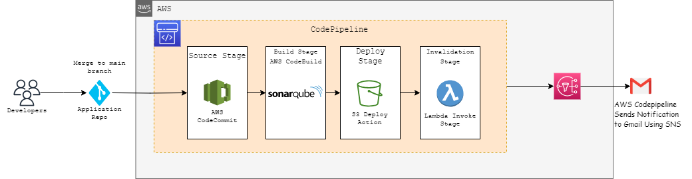

# AWS DevOps pipeline architecture - CI/CD of Static-website (S3 CDN stack)

## Description

AWS DevOps pipeline architecture for CI/CD of a static website is versatile and can be utilized by a broad range of stakeholders involved in the software development lifecycle. It promotes collaboration, automation, and efficiency in delivering static website updates to production environments.
The goal is to automate the build, testing, and deployment processes to achieve faster and more reliable software releases while maintaining the highest level of security and scalability. The blueprint is able to create the pipeline with Continuous Integration and Continuous Deployment (CI/CD) of a static website hosted on an S3 bucket with a CDN (Content Delivery Network) stack into the single pipeline.
- Who can use AWS DevOps pipeline architecture - CI/CD of Static-website (S3 CDN stack):
    - Developers can use the CI/CD pipeline to automate the building and deployment of their static website code. They benefit from faster feedback loops, ensuring that changes are deployed consistently and quickly.
    - DevOps engineers are responsible for designing and implementing CI/CD pipelines. They can leverage this blueprint to create a scalable, automated deployment process for static websites.
    - QA teams may use the CI/CD pipeline to deploy different versions of the static website for testing purposes. Automated testing steps can be added to the pipeline to ensure the quality of the deployed code.
    - Infrastructure engineers can benefit from the Infrastructure as Code (IaC) components of the blueprint. They can manage and version control the AWS infrastructure using CloudFormation or Terraform.
    - Release managers can use the pipeline to orchestrate the release process, ensuring that the correct version of the website is deployed to production and other environments.
    - Project managers can benefit from the streamlined and automated deployment process. They can track the progress of deployments and ensure that timelines are met.
    - Technical leads can guide and lead the implementation of the CI/CD pipeline, making architectural decisions and ensuring that the pipeline meets performance and scalability requirements.


## Overview
-  This is a Jinja templates for deploying AWS devops pipeline architecture for Static website on AWS using AWS CodePipeline, S3 bucket for atifacts,Lambda Function for CloudFront Invalidation,AWS SNS for Notifications and IAM Roles and policies  with AWS CloudFormation.
## Parameters 
The template includes several parameters that allow you to customize the deployment:
1. **Env**: The name of the environment (e.g., "dev," "prod").
2. **StackName**: The name of the CloudFormation stack to create.
3. **S3BucketName**: Name of the Existing Amazon S3 bucket where the artifacts generated by the build process will be stored .
4. **RepoName**: Name of the AWS CodeCommit repository where your application source code is stored.
5. **BranchName**: Name of the branch in the CodeCommit repository that will be monitored for changes.Whenever changes are pushed to this branch, the pipeline will automatically start.
6. **ComputeType**: The type of compute environment. This determines the number of CPU cores and memory the build environment uses.
7. **Image**: The image tagthat identifies the Docker image to use for this build project.
8. **Type**: The type of build environment to use for related builds.
9. **Emails**: Email address to receive notifications via SNS

## Resources
- AWS CodePipeline: A fully automated pipeline with source, build, deploy, and invalidation stages.
  
  -  Source Stage: Retrieves source code from a repository and triggers the pipeline. It prepares source code for    further processing.
  
  -  Build Stage: Transforms source code into deployable artifacts. It compiles, tests, and packages code for deployment.
  
  - Deploy Stage: Releases artifacts to a target environment, making the application available. It ensures consistency between source code and deployed version.

  -   Invalidation Stage: Ensures CDN (e.g., CloudFront) reflects the latest changes. It triggers cache removal for updated content, providing users with up-to-date resources.
- S3 Bucket for Artifacts: A designated Amazon S3 bucket to store artifacts generated by CodePipeline.
- Lambda Function for CloudFront Invalidation: A Lambda function responsible for invalidating the CloudFront cache associated with your application.
- AWS SNS for Notifications: Setup for sending notifications through AWS SNS.
  - CloudFrontInvalidationLambdaFunctionRole: This IAM role is used for the Lambda function that handles CloudFront invalidations. It has the following policies attached:
    - CloudFrontFullAccess
    - AWSCodePipeline_FullAccess

  - SNSTopicPolicy: This is an SNS topic policy that allows CodeStar Notifications service to publish to the SNS topic.

  - MyCodeStarNotificationRule: This is a CodeStar Notifications rule that specifies events and targets for notifications. It's associated with the SNS topic.

## Jinja2 Templating
- Throughout the template, you can see Jinja2 syntax enclosed in double curly braces ({{ ... }}). These sections are placeholders for variables, and they likely get replaced with actual values when generating the CloudFormation template based on the context in which the Jinja template is processed.
## Rendering CFT Template
- It's important to note that the actual values for the parameters and Jinja2 variables must be provided when creating a CloudFormation stack using this template. These values will determine the specific configuration of the stack.
- To use this template to create an AWS CloudFormation stack, you would typically process it through a Jinja2 renderer tool to replace the Jinja2 variables with their actual values, and then submit the resulting CloudFormation template to AWS for stack creation. The specific details of the infrastructure and its configuration would depend on the actual values provided for the parameters and Jinja2 variables.
- To render/parse the cloudofrmation jinja template to yaml use the below command
```
python3 render-templates.py <input_template_name>.j2 <variables_file_name>.yaml <output_cft_file_name>.yaml
```
## Usage
- From the above command the CFT template file(<output_cft_file_name>.yaml) will be generated, which can be used to create the stack AWS CFT.
