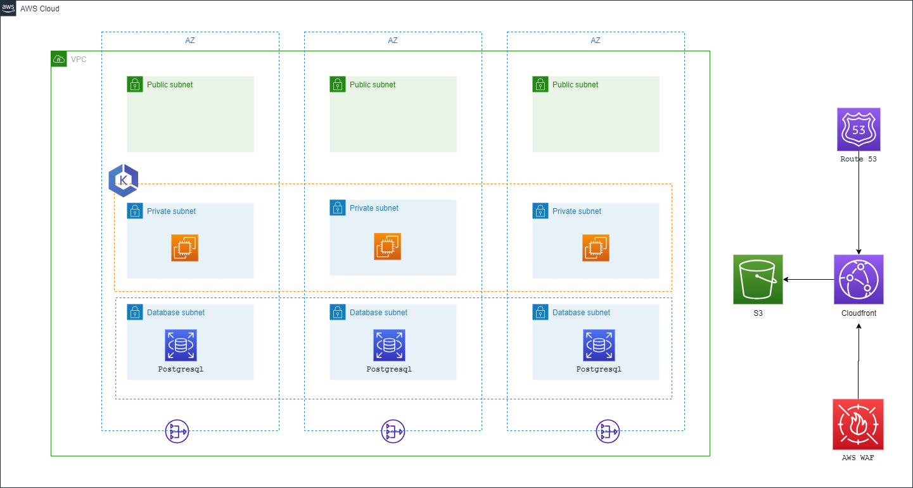

# AWS EKS CDN

## Discription

Microservices architecture with EKS, S3 CDN, and PostgreSQL implemented through IaC is a collaborative framework that involves various roles throughout the software development and deployment lifecycle. Its modular and scalable nature makes it suitable for diverse stakeholders, promoting efficiency, maintainability, and scalability in cloud-based applications.
Who can use Micro service architecture with EKS, S3 CDN and PSQL:
1) Developers can leverage the microservices architecture to build and deploy individual services independently. They can work on specific microservices, taking advantage of EKS for container orchestration and scalability.
2) DevOps engineers can utilize Terraform to define and manage the infrastructure as code (IaC), automating the deployment and scaling of microservices on EKS. They can also configure CI/CD pipelines for continuous integration and delivery
3) System architects can design the overall microservices architecture, defining the communication patterns between services. They can use Terraform to model the infrastructure components, ensuring scalability, reliability, and fault tolerance.
4) DBAs can be involved in setting up and managing the PostgreSQL database instances, ensuring proper configuration, backups, and monitoring.
5) End users interact with the application that is built on the microservices architecture. The use of CDN ensures faster content delivery and a better user experience.

## Overview
- This is a Jinja templates for deploying AWS EKS CDN on AWS using Amazon Virtual Private Cloud (Amazon VPC), Amazon Relational Database Service(RDS), Amazon Elastic Kubernetes Service (Amazon EKS),Amazon Elastic Kubernetes Service (Amazon EKS) , Amazon S3 CDN and Route 53 record with AWS CloudFormation.

## Parameters
The template includes several parameters that allow you to customize the deployment:
1. **Env**: The name of the environment (e.g., "dev," "prod").
2. **StackName**: The name of the CloudFormation stack to create.
- Network Configuration
3. **VPCCIDR**: The CIDR range for your Virtual Private Cloud (VPC).
4. **PublicSubnetCIDRs**: A list of public subnet CIDR blocks inside the VPC.
5. **PrivateSubnetCIDRs**: A list of private subnet CIDR blocks inside the VPC.
6. **DataSubnetCIDRs**: A list of database subnet CIDR blocks inside the VPC.
- RDS
7. **EngineType**: The "EngineType" in an AWS RDS cluster refers to the specific database management system software or database engine that powers your RDS instance. 
8. **EngineVersion**: The "EngineVersion" within an AWS RDS cluster denotes the specific version or release of the chosen database engine type.
9. **DbMasterUsername**: The "DbMasterUsername" is a configuration parameter used when setting up and configuring a relational database, particularly in services like Amazon Web Services (AWS) Relational Database Service (RDS).
10. **DbMasterPassword**: The "DbMasterPassword" is a crucial configuration parameter used when setting up an RDS instance or cluster. It specifies the password associated with the master user account, which is a privileged account with administrative rights over the database system.
11. **DbClusterInstanceClass**:  "DbClusterInstanceClass" is a configuration parameter used in AWS RDS when creating or modifying a database cluster. 
12. **RdsStorage**:  "RdsStorage" refers to the storage configuration for an RDS instance or cluster. It specifies the amount of storage allocated for the database's data, logs, and backups. 
- EKS 
13. **ClusterVersion**:  "ClusterVersion" typically refers to the version or release of a cluster management software or platform. In the context of clusters, such as Kubernetes clusters, it represents the specific version of Kubernetes or the cluster orchestration tool being used. 
14. **NodeCapacityType**:  "NodeCapacityType" is a parameter used in cluster management to specify the type of capacity allocated to cluster nodes. 
15. **NodeInstanceType**:   "NodeInstanceType" is a parameter used in cloud computing environments and cluster management to define the specific type of virtual machine (VM) or instance that makes up the cluster nodes.
16. **EKSNodeDesiredSize**: "EKSNodeDesiredSize" is a parameter related to Amazon Elastic Kubernetes Service (EKS) clusters. It represents the desired number of worker nodes in an EKS cluster. 
17. **EKSNodeMinSize**: EKSNodeMinSize" is another parameter specific to Amazon EKS clusters. It sets the minimum number of worker nodes that should be maintained in the cluster, even during periods of low demand. 
18. **EKSNodeMaxSize**: "EKSNodeMaxSize" is also specific to Amazon EKS clusters. It defines the maximum number of worker nodes that can be part of the cluster. 
- S3 and CDN
19. **ACMCertificateArn**: "ACMCertificateArn" represents the Amazon Resource Name (ARN) of an SSL/TLS certificate managed through AWS Certificate Manager (ACM).
20. **AlternateDomain**: "AlternateDomain" typically refers to an additional or alternative domain name associated with a web application or service.
21. **ZoneId**:  "ZoneId" commonly refers to the identifier of a DNS (Domain Name System) zone in a domain name management system.
## Conditions
- These are conditionals that can be used to control resource creation within the CloudFormation template.
1. Conditions for Subnet and Route Creation:
    - Conditions are implied within the loops for creating public, private, and database subnets. These loops iterate through lists of subnets and create corresponding resources. The conditions are not explicitly defined, but they rely on the values provided in the public_subnets, private_subnets, and database_private_subnets parameters. Resources are created for each subnet in these lists.
2. Conditions for RDS Cluster Creation:
    - The DBSubnetGroup resource specifies a list of subnet IDs based on the DatabasePrivateSubnet1, DatabasePrivateSubnet2, and DatabasePrivateSubnet3 references. These references imply that the RDS cluster will be created in the specified subnets if those subnets exist.
3. Conditions for S3 and CloudFront Creation:
    - The WebCloudfront resource specifies the Origins property using references to the S3 bucket and an origin access control ID. This implies that the CloudFront distribution will be created with the specified S3 bucket as its origin.
4. Conditions for Route 53 Record Creation
    - Route 53 record sets are created based on the values in the cdn_aliases parameter. For each alias specified in the parameter, a corresponding Route 53 record set is created with a CNAME type pointing to the CloudFront distribution's domain name.

## Resources
- VPC: Virtual Private Cloud.
- InternetGateway: Connects the VPC to the internet.
- PublicSubnetX: Public subnets within the VPC. 
- PrivateSubnetX: Private subnets within the VPC.
- NatEIPX: Elastic IPs for NAT gateways in public subnets.
- NatGatewayX: NAT gateways for private subnets.
- DBSubnetGroup: RDS DB subnet group.
- RdsCluster: Amazon RDS DB cluster.
- Cluster: Amazon EKS cluster.
- NodeGroup: Amazon EKS node group.
- S3Bucket: Amazon S3 bucket.
- WebCloudfront: CloudFront distribution.
- Route53RecordX: Route 53 record sets for CDN aliases
## Jinja2 Templating
- Throughout the template, you can see Jinja2 syntax enclosed in double curly braces ({{ ... }}). These sections are placeholders for variables, and they likely get replaced with actual values when generating the CloudFormation template based on the context in which the Jinja template is processed.
## Rendering CFT Template
- It's important to note that the actual values for the parameters and Jinja2 variables must be provided when creating a CloudFormation stack using this template. These values will determine the specific configuration of the stack.
- To use this template to create an AWS CloudFormation stack, you would typically process it through a Jinja2 renderer tool to replace the Jinja2 variables with their actual values, and then submit the resulting CloudFormation template to AWS for stack creation.  The specific details of the infrastructure and its configuration would depend on the actual values provided for the parameters and Jinja2 variables.
- To render/parse the cloudofrmation jinja template to yaml use the below command
```
python3 render-templates.py <input_template_name>.j2 <variables_file_name>.yaml <output_cft_file_name>.yaml
```
## Usage
- From the above command the CFT template file(<output_cft_file_name>.yaml) will be generated, which can be used to create the stack AWS CFT.
