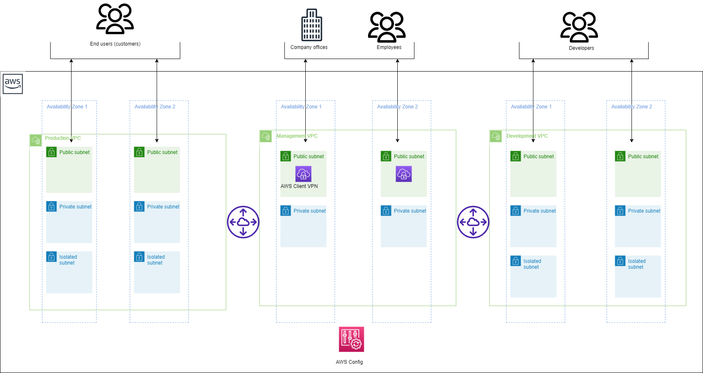

# AWS Fintech Infrastructure on AWS

## Description

The architecture provides a robust and scalable environment with high availability, security, and monitoring capabilities. It follows best practices to ensure a well-architected AWS infrastructure that can handle your application’s demands while maintaining your data's confidentiality, integrity, and availability. It's for companies that want to manage their business-to-business (B2B) or business-to-consumer (B2C) fintech software in the cloud.
FinTech Blueprint on AWS using Infrastructure as Code is a collaborative tool that involves various roles throughout the software development and deployment lifecycle in the financial technology sector. It facilitates consistency, scalability, and security in the deployment of FinTech applications and services on the AWS cloud.
- Who can use Fintech Blueprint on AWS
    - Developers working in the FinTech domain can leverage the blueprint to deploy and scale applications that handle financial transactions, data analytics, risk management, or other financial services on AWS.
    - DevOps engineers play a crucial role in automating infrastructure deployment and management. They can use the IaC blueprint to define and provision AWS resources, set up CI/CD pipelines, and manage configurations for FinTech applications.
    - System architects design the overall architecture of FinTech applications, ensuring scalability, security, and compliance. They can use IaC to model the infrastructure components, allowing for consistent and repeatable deployments.
    - Professionals working with financial data analytics can benefit from the blueprint's ability to provision scalable and performant AWS resources for processing and analyzing financial data.
    - Professionals responsible for regulatory compliance in the financial sector can benefit from the IaC blueprint by ensuring that the infrastructure configurations align with industry regulations and standards.

## Overview
- This is a Jinja templates for deploying AWS fintech infrastructure on AWS using CloudFormation . The infrastructure contains 3 VPC , VPC peering, NAT gateway , AWS Client VPN and AWS Config rules.

## Parameters
The template includes several parameters that allow you to customize the deployment:
1. **Env**: The name of the environment (e.g., "dev," "prod").
2. **StackName**: The name of the CloudFormation stack to create.
- Network Configuration
3. **vpc_production_cidr**: Specify the range of IP addresses for your VPC in CIDR notation. For example, if you want to allocate IP addresses from 10.0.0.0 to 10.0.255.255, you would use "10.0.0.0/16" as the CIDR range.
4. **vpc_management_cidr**: Specify the range of IP addresses for your VPC in CIDR notation. For example, if you want to allocate IP addresses from 192.168.0.0 to 192.168.255.255, you would use "192.168.0.0/16" as the CIDR range.
5. **vpc_development_cidr**: Specify the range of IP addresses for your VPC in CIDR notation. For example, if you want to allocate IP addresses from 172.16.0.0 to 172.16.255.255, you would use "172.16.0.0/16" as the CIDR range.
6. **production_public_cidr**: Customize the CIDR ranges for your public subnets using a list format. To define multiple private subnets, provide a comma-separated list of CIDR ranges enclosed in square brackets. For instance: ["10.0.0.0/24", "10.0.1.0/24", "10.0.2.0/24"].
7. **production_private_cidr**: Customize the CIDR ranges for your private subnets using a list format. To define multiple private subnets, provide a comma-separated list of CIDR ranges enclosed in square brackets. For instance: ["10.0.0.0/24", "10.0.1.0/24", "10.0.2.0/24"].
8. **production_isolated_cidr**: Customize the CIDR ranges for your isolated subnets using a list format. To define multiple private subnets, provide a comma-separated list of CIDR ranges enclosed in square brackets. For instance: ["10.0.0.0/24", "10.0.1.0/24", "10.0.2.0/24"].
9. **management_public_cidr**: Tailor the CIDR ranges for  subnets using a list format. To define multiple subnets, provide a comma-separated list of CIDR ranges enclosed in square brackets. For example: ["192.168.1.0/24", "192.168.3.0/24"].
10. **management_private_cidr**: Tailor the CIDR ranges for  subnets using a list format. To define multiple subnets, provide a comma-separated list of CIDR ranges enclosed in square brackets. For example: ["192.168.1.0/24", "192.168.3.0/24"].
11. **development_public_cidr**: Tailor the CIDR ranges for  subnets using a list format. To define multiple subnets, provide a comma-separated list of CIDR ranges enclosed in square brackets. For example:["172.16.1.0/24", "172.16.3.0/24"].
12. **development_private_cidr**: Tailor the CIDR ranges for  subnets using a list format. To define multiple subnets, provide a comma-separated list of CIDR ranges enclosed in square brackets. For example:["172.16.1.0/24", "172.16.3.0/24"].
13. **development_isolated_cidr**: Tailor the CIDR ranges for  subnets using a list format. To define multiple subnets, provide a comma-separated list of CIDR ranges enclosed in square brackets. For example:["172.16.1.0/24", "172.16.3.0/24"].
14. **clientcidrblock**: Client CIDR block to connect with VPN.
15. **server_certificate**: The Amazon Resource Name (ARN) of the server certificate
15. **client_certificate**: The Amazon Resource Name (ARN) of the clients root certificate chain
16. **aws_configrules**: The aws_configrules variable allows you to specify a list of AWS Config rules or configurations within your infrastructure code.

## Conditions
- These are conditionals that can be used to control resource creation within the CloudFormation template. They are based on the values of certain parameters or resource attributes.
    - Loops in Public Subnet Creation : Loops are used to create public subnets in each VPC. These loops iterate over lists of CIDR blocks (production_public_cidr, management_public_cidr, development_public_cidr) and create a subnet and associated resources for each CIDR block.
The reason for using loops is to automate the creation of multiple subnets with similar configurations without duplicating the code.
    - NAT Gateway and EIP Creation : Loops are used to create NAT gateways and Elastic IPs (EIPs) for each public subnet in each VPC.
This is done to provide internet access to private subnets within each VPC. Each public subnet gets its own NAT gateway and EIP.

## Resources
-  VPC Creation
    - Creates a Virtual Private Cloud (VPC) with specified CIDR blocks and necessary configurations.
- Internet Gateway
    - Creates an Internet Gateway and attaches it to the VPC for public internet access.
- Public Subnets
    - Creates public subnets and associates them with a public route table.
- Private Subnets
    - Creates private subnets and associates them with a private route table.
- Isolated Subnet
    - Creates isolated subnets which can be used for database.
- VPC peering
    -  Allows you to connect two Virtual Private Clouds (VPCs) together within the same AWS region or across different AWS regions.  
- Nat Gateway
    -   Allows resources in a private subnet of a Virtual Private Cloud (VPC) to initiate outbound connections to the internet while preventing incoming traffic from the internet from directly accessing those resources. 
- AWS Client VPN 
    - Allows remote users or clients, such as employees, partners, or customers, to securely connect to your AWS VPC (Virtual Private Cloud) and access resources within the VPC, as well as resources on the internet, through a VPN (Virtual Private Network) connection.
- AWS Config rules 
    - Allows you to create and manage rules for automatically evaluating the configuration settings of your AWS resources. Config Rules help you ensure compliance with your organization's security and operational best practices by continuously monitoring and assessing the configuration of your AWS resources

## Rendering CFT Template
- It's important to note that the actual values for the parameters and Jinja2 variables must be provided when creating a CloudFormation stack using this template. These values will determine the specific configuration of the stack.
- To render/parse the cloudofrmation jinja template to yaml use the below command
```
python3 render-templates.py <input_template_name>.j2 <variables_file_name>.yaml <output_cft_file_name>.yaml
```

## Usage
- From the above command the CFT template file(<output_cft_file_name>.yaml) will be generated, which can be used to create the stack AWS CFT  .
