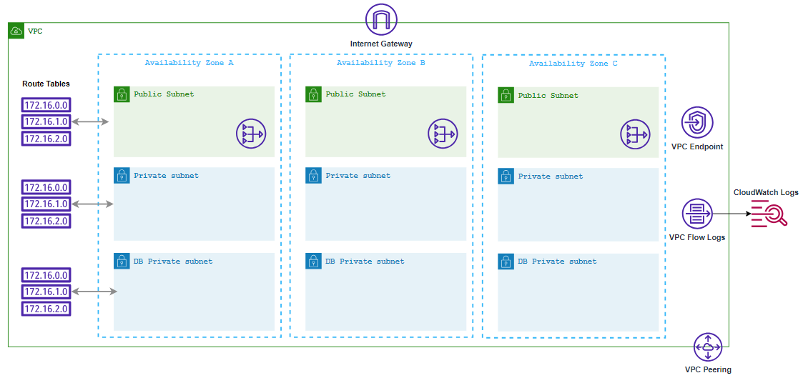

# Amazon VPC Configuration Guide 


## Description

Amazon VPC Configuration Guide provides a robust, secure, and scalable foundation for deploying applications in the cloud. It aligns with best practices for network architecture, security, and operational efficiency in AWS environments. It provides a standardized and consistent approach to managing your infrastructure deployments across different environments, making it easier to maintain and evolve your applications over time.
The blueprint includes the setup of fundamental networking components such as VPCs, subnets, security groups, and extends to advanced features like VPC Flow Logs, VPC Endpoints, VPC Peering, and integration with AWS CloudWatch Logs.
- Who can use Amazon VPC Configuration Blueprint?
    - Infrastructure engineers or cloud architects responsible for designing and implementing AWS infrastructure.
    - DevOps teams involved in automating and managing the end-to-end deployment lifecycle.
    - Cloud architects responsible for defining cloud architecture, policies, and standards within an organization.
    - Network administrators responsible for configuring and managing network infrastructure.
    - Security teams responsible for defining and enforcing security policies.
    - Application developers deploying and managing applications in AWS.
    - Compliance teams ensuring that infrastructure configurations adhere to industry regulations and internal policies.
    - Operations teams responsible for monitoring and maintaining deployed infrastructure.
    
## Overview
- This is a Jinja templates for deploying  Amazon VPC Configuration Guide using Amazon Virtual Private Cloud (VPC), security groups, VPC Flowlogs, VPC Endpoint, VPC Peering, and AWS Cloudwatch logs.
- This AWS CloudFormation template is designed to create a Amazon VPC Configuration Guide infrastructure stack. The stack consists of multiple components, including Amazon Virtual Private Cloud (VPC), security groups, VPC Flowlogs, VPC Endpoint, VPC Peering, and AWS Cloudwatch logs. This template is designed to be customizable with various parameters to adapt to different environments and use cases.

## Parameters
The template includes several parameters that allow you to customize the deployment:
1. **Env**: The name of the environment (e.g., "dev," "prod").
2. **StackName**: The name of the CloudFormation stack to create.
- Network Configuration
3. **VPCCIDR**: The CIDR range for your Virtual Private Cloud (VPC).
4. **PublicSubnetCIDRs**: A list of public subnet CIDR blocks inside the VPC.
5. **PrivateSubnetCIDRs**: A list of private subnet CIDR blocks inside the VPC.
6. **DatabaseSubnetCIDRs**: A list of database subnet CIDR blocks inside the VPC.
- Endpoint Configuration
7. **ServiceName**:  The name of the service for which the VPC endpoint is being created.
8. **VpcEndpointType**: The type of VPC endpoint, specifying the service communication method.
9. **PrivateDnsEnabled**: A flag indicating whether private DNS resolution is enabled for the VPC endpoint.
- Peering Configuration
10. **PeerRegion**: The AWS region where the peer VPC is located.
11. **PeerOwnerID**: The AWS account owner ID of the peer VPC.
12. **PeerVPCCIDRRange**: The CIDR block range of the peer VPC.
13. **PeerVpcId**: The ID of the peer VPC that you want to establish a VPC peering connection with.

## Resources
- VPC Creation
    - Creates a Virtual Private Cloud (VPC) with specified CIDR blocks and necessary configurations.
- Internet Gateway
    - Creates an Internet Gateway and attaches it to the VPC for public internet access.
- Public Subnets
    - Creates public subnets and associates them with a public route table.
- Private Subnets
    - Creates private subnets and associates them with a private route table.
- Database Subnets
    - Creates database subnets and associates them with a database route table.
- VPCFlowLog
    - configures the flow logs for the VPC, allowing you to capture network traffic data for analysis and monitoring.
- VpcEndpoint
    - This resource creates a VPC endpoint, enabling communication between your VPC and AWS services without traversing the public internet.
- VpcPeeringConnection
    - Establishes a VPC peering connection between your VPC and a peer VPC in a different region or owned by a different AWS account, allowing private communication between the VPCs.
    
## Jinja2 Templating
- Throughout the template, you can see Jinja2 syntax enclosed in double curly braces ({{ ... }}). These sections are placeholders for variables, and they likely get replaced with actual values when generating the CloudFormation template based on the context in which the Jinja template is processed.
## Rendering CFT Template
- It's important to note that the actual values for the parameters and Jinja2 variables must be provided when creating a CloudFormation stack using this template. These values will determine the specific configuration of the stack.
- To use this template to create an AWS CloudFormation stack, you would typically process it through a Jinja2 renderer tool to replace the Jinja2 variables with their actual values, and then submit the resulting CloudFormation template to AWS for stack creation. The specific details of the infrastructure and its configuration would depend on the actual values provided for the parameters and Jinja2 variables.
- To render/parse the cloudofrmation jinja template to yaml use the below command
```
python3 render-templates.py <input_template_name>.j2 <variables_file_name>.yaml <output_cft_file_name>.yaml
```
## Usage
- From the above command the CFT template file(<output_cft_file_name>.yaml) will be generated, which can be used to create the stack AWS CFT.


